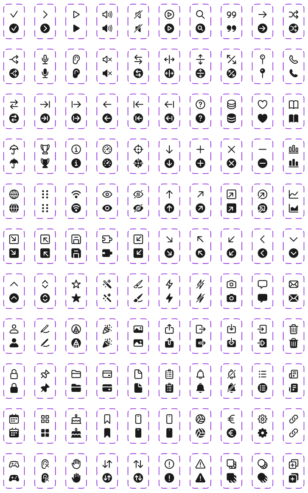

# Flow Icons

A beautiful collection of **110 React icons** with clean SVG design, available in both **outline** and **filled** variants.



## ✨ Features

- 🎨 **110 unique icons** with consistent design
- 🔄 **Dual variants**: Outline and Filled versions
- ⚛️ **React + TypeScript** components
- 🎯 **Fully typed** with TypeScript interfaces
- 🎛️ **Customizable**: Size, color, and variant props
- 📦 **Tree-shakable** imports
- 🚀 **Production ready**

## 📦 Installation

```bash
npm install flow-icons
```

## 🚀 Usage

### Basic Usage

```tsx
import { Heart, Star, Settings } from 'flow-icons';

function App() {
  return (
    <div>
      {/* Default outline version */}
      <Heart />
      
      {/* Filled version */}
      <Star filled />
      
      {/* Custom size and color */}
      <Settings size={32} color="#e91e63" />
    </div>
  );
}
```

### Advanced Usage

```tsx
import { 
  AlertCircle, 
  AlertCircleOutline, 
  AlertCircleFilled 
} from 'flow-icons';

function Notifications() {
  return (
    <div>
      {/* Smart component with filled prop */}
      <AlertCircle filled={true} size={24} color="#ff5722" />
      
      {/* Direct variant usage */}
      <AlertCircleOutline size="1.5rem" color="currentColor" />
      <AlertCircleFilled size={20} color="#4caf50" />
    </div>
  );
}
```

## 🎛️ Props

All icon components accept the following props:

| Prop | Type | Default | Description |
|------|------|---------|-------------|
| `size` | `number \| string` | `24` | Icon size (px or any CSS unit) |
| `color` | `string` | `"currentColor"` | Icon color (inherits from parent, or any CSS color) |
| `filled` | `boolean` | `false` | Show filled variant (main components only) |

## 📚 Available Icons

### Categories

- **Arrows**: ArrowUp, ArrowDown, ArrowLeft, ArrowRight, etc.
- **Actions**: Plus, Minus, Check, X, etc.
- **UI Elements**: Bars, Settings, Bell, Heart, etc.
- **Communication**: Phone, Enveloppe, Microphone, etc.
- **Media**: Play, Camera, Picture, Speaker, etc.
- **Files**: File, Folder, FloppyDisk, etc.
- **And many more...**

### Complete Icon List

<details>
<summary>View all 110 icons</summary>

- AlertCircle, AlertTriangle
- Android, ArrowBottomTop, ArrowDown, ArrowDownLeft, ArrowDownRight
- ArrowLeft, ArrowLeftRight, ArrowLineLeft, ArrowLineRight, ArrowRight
- ArrowRightLeft, ArrowSplitDiagonal, ArrowSplitHorizontal, ArrowSplitVertical
- ArrowTopBottom, ArrowUp, ArrowUpLeft, ArrowUpRight, Bars, Bell
- BellSlash, Bolt, BoltSlash, Book, Bookmark, Brush, Bubble
- Cake, Calendar, Camera, Chart, Check, ChevronDown, ChevronLeft
- ChevronRight, ChevronUp, ChevronUpDown, CircleArrowUpRight, Clipboard
- CreditCard, Crosshair, DataBase, DotsSixVertical, Ear, EarOff
- Enveloppe, Euro, Eye, EyeSlash, File, FloppyDisk, Folder
- GameController, Gauge, Globe, Hand, Heart, Information, Invoice
- Iphone, LineArrowLeft, LineArrowRight, Link, ListItem, Lock
- MagicWand, MagnifyingGlass, MapPin, Microphone, Minus, Pencil
- PencilVertical, Person, Phone, Picture, Pin, Play, PlayCircle
- Plus, Popper, PuzzlePiece, QuestionMark, Quote, Separate
- Settings, Shuffle, SpeakerOff, SpeakerOn, SpeakerSlash
- SquareArrowDown, SquareArrowDownLeft, SquareArrowDownRight
- SquareArrowIn, SquareArrowOut, SquareArrowUp, SquareArrowUpLeft
- SquareArrowUpRight, SquareSquarePlus, Squares, Star, SubtractCircle
- SubtractSquare, Trash, Trophy, Umbrella, VoleyBall, Wifi, X

</details>

## 🛠️ Development

### Project Structure

```
flow-icons/
├── src/icons/           # Generated React components
├── svg/                 # Source SVG files
├── generate-icons.js    # Generation script
└── dist/               # Built package
```

### Building

```bash
npm run build
```

### Regenerating Icons

If you modify the SVG files, regenerate the components:

```bash
node generate-icons.js
```

## 🎨 Design Philosophy

- **Consistent**: All icons follow the same 24x24 grid and visual weight
- **Clean**: Minimalist design with clear, recognizable shapes
- **Flexible**: Easily customizable colors and sizes
- **Accessible**: High contrast and clear visual hierarchy

## 📄 License

Apache 2.0 License - see [LICENSE](./LICENSE) file for details.

## 👥 Credits

- **Design**: Gauthier Niglio
- **Development**: Benjamin Merchin